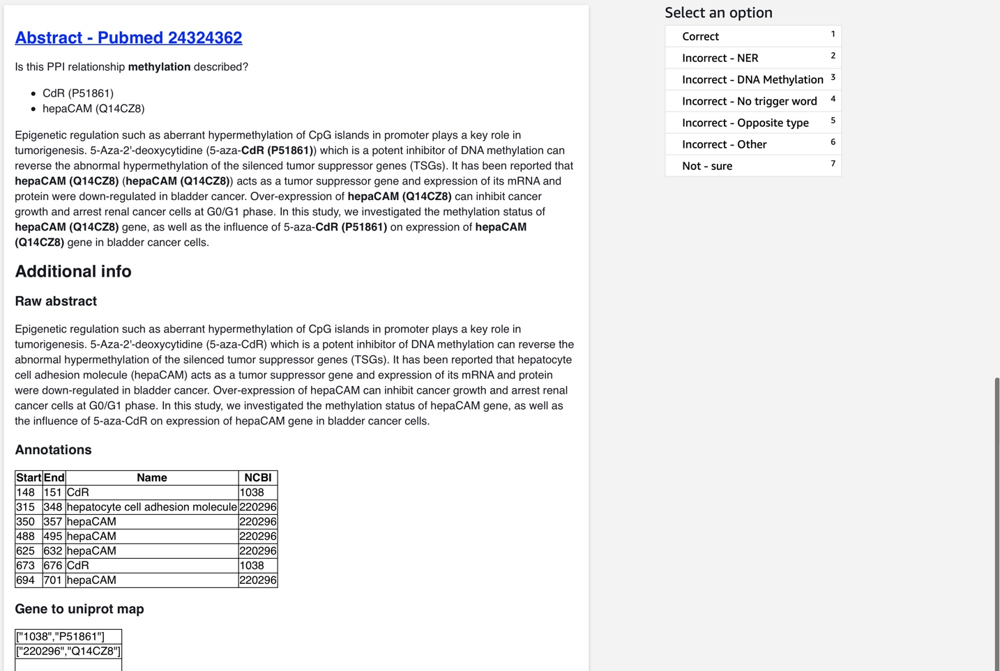
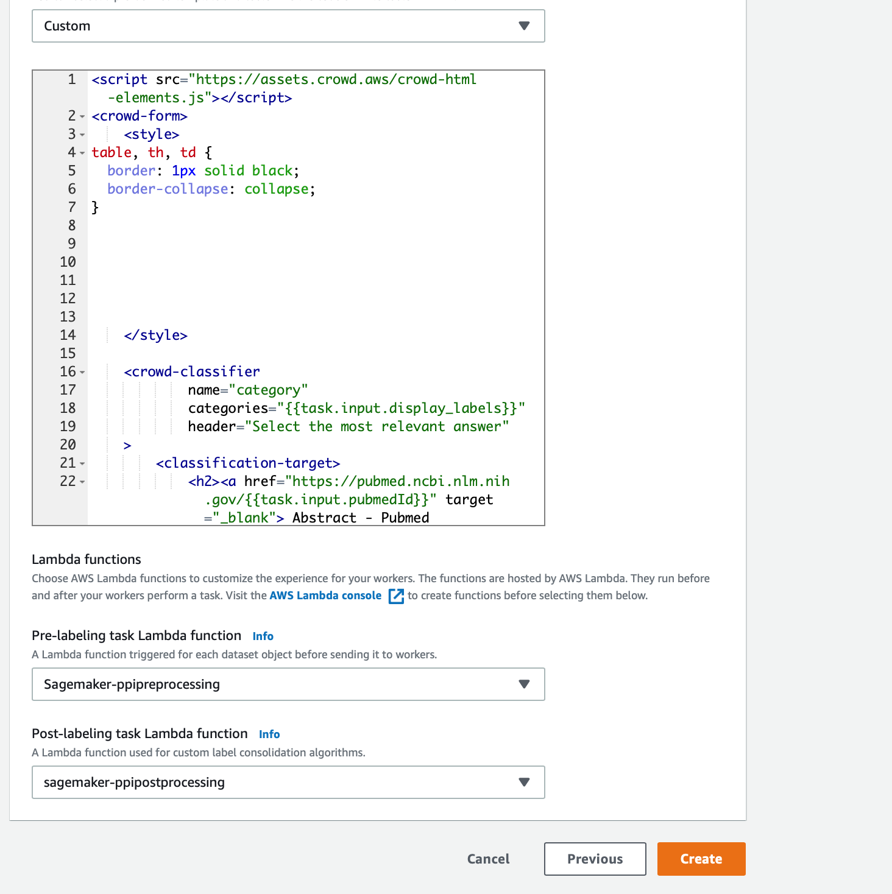

[](https://travis-ci.org/elangovana/ppi-sagemaker-groundtruth-verification)

# SageMaker GroundTruth  - PPI extraction verification
This is a sample template for SageMaker  ground truth solution for verifying PPI extraction. 
This has 3 components
1. The HTML template that the workers will use to work on the task
1. Lambda functions for pre and post processing rules.





## Setup
1. If you want try this sample but dont have the data to test this, you cam use this a sample file [tests/sample_input_data_pubtator.txt](tests/sample_input_data_pubtator.txt) as input data to evaluate the workflow.

1. Create pre and post processing lambda functions
    - **Note** Using the naming convention SageMaker-* for your lambda functions automatically gives access to Sagemaker using the standard template. Otherwise you would have to use create an IAM policy and provide access to Sagemaker to execute the lambda function
   
    - Create a lambda function `SageMaker-PPIPreProcessing` with runtime python 3.7 using the code [src/lambda_handler/preprocess.py](src/lambda_handler/preprocess.py) . 
   
    - Create a lambda function `SageMaker-PPIPostProcessing` with runtime python 3.7 using the code [src/lambda_handler/postprocess.py](src/lambda_handler/postprocess.py) with lambda basic execution role. **Make sure this has access to read the s3 bucket** containing the results from Sagemaker groundtruth job you are about to create. See example policy below
    
       ```json
        {
            "Version": "2012-10-17",
            "Statement": [
                {
                    "Sid": "VisualEditor0",
                    "Effect": "Allow",
                    "Action": "s3:GetObject",
                    "Resource": "arn:aws:s3:::mybucket/*"
                }
            ]
        }
       ```

1. Configure SageMaker Ground Truth as follows:
  
   - Choose custom template in Sagemaker Ground Truth
  
   - In the custom template section, copy paste the html from [source/template/template.html](source/template/template.html)
   
   - In the Pre-labelling task lambda function, select `Sagemaker-PPIPreProcessing`
   
   - In the Post-labelling task lambda function, select `Sagemaker-PPIPostProcessing`



 

## Run tests

```bash
export PYTHONPATH=./source
pytests
```
